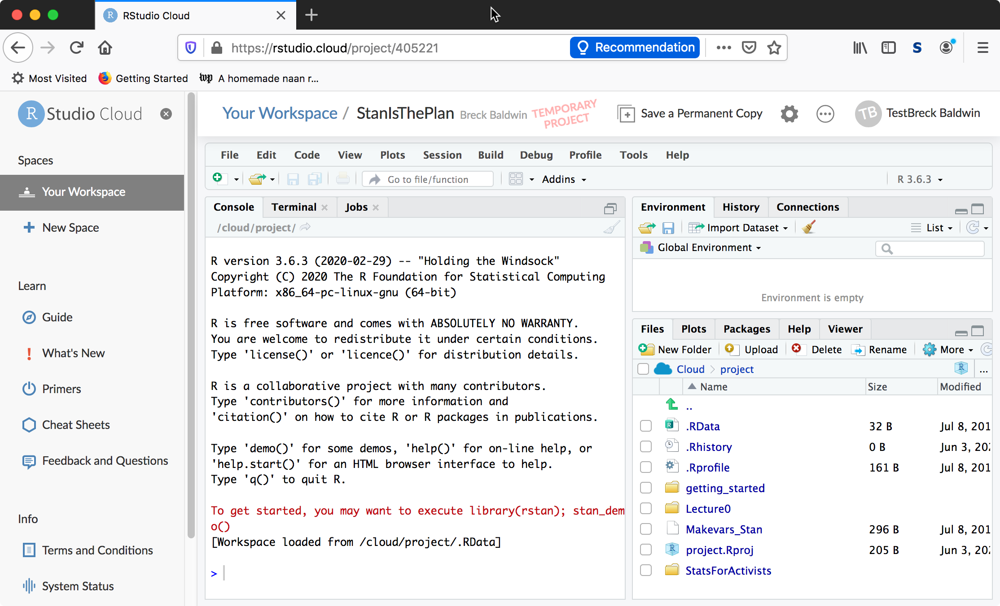
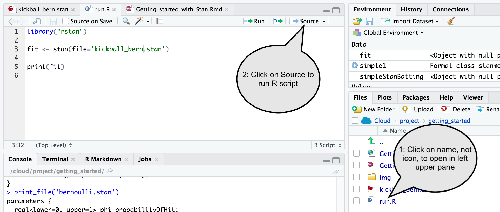

```{r setup, include=FALSE}
knitr::opts_chunk$set(echo = TRUE)
print_file <- function(file) {
  cat(paste(readLines(file), "\n", sep=""), sep="")
}
```

Welcome to the world of Bayesian modeling via Stan. This unit cover basic skills needed to run Stan models from the RStudio Cloud interface. It assumes minimal R skills. This unit can be seen in [https://rstudio.cloud/project/405221](https://rstudio.cloud/project/405221) in the `getting_started` folder in file `Getting_started_with_Stan.html`

## Inventory of components

The Stan modeling envirionment has many components under the same roof/repo. Below I cover the major components and how they relate to each other to support the ultimate goal of doing Bayesian modeling. 

* [RStudio Cloud](https://rstudio.cloud/): The fine folks at RStudio, creators of an integrated development environment (IDE) for the R statistial programming langauge, have created a cloud version of the entire IDE. IDEs are optimized interfaces for writing, debugging and viewing computer programs and are a significant portion of how people develop scientific/engineering programs. RStudio Cloud supports Stan programs directly with syntax checking and the cloud computing implementation supports compiling and running Stan programs via calls from the R language using the RStan library.
* [RStan](https://mc-stan.org/rstan/): RStan is an interface between the R language, a very popular statisics language, and the Stan ecosystem. There are other interface languages (Python, Scalia, Julia etc...) as well. We will be using as little R as possible to run our Stan programs in this unit but as your mastery of Stan grows you will find yourself using the data munging and visualization strengths of your chosen interface language increasingly.
* [Stan](https://mc-stan.org/): Stan its self is a compiled modeling language for specifying and doing inference over Bayesian models. The Stan compiler turns a Stan program into a C++ executable that is run by RStan and the results of the run are collected and returned by RStan. The R language runs the show for these units but CmdStan exists as a way to compile and run Stan programs directly. 

## Getting setup with RStudio Cloud
For now RStudio Cloud has free accounts which are limited but sufficient for this unit. Go to [https://rstudio.cloud/project/405221](https://rstudio.cloud/project/405221) and either create an account or login with github/google credentials. This should leave with a screen that looks like this:



If you set up a new login you will need to confirm your email by replying to a confirmation email. The session starts fine but I don't know what happens if you fail to confirm in the long term. 

## My first Stan program

Open the `getting_started` folder and open `kickball_bern.stan`. Real world Bayesian modeling has a strong narrative tradition which means that data does not stand alone but rather in the context of what is known, what is wanted to be known and more. So for the below 'toy' example I offer my earliest statistical inference memory that included uncertainty--playing kickball in 4th grade. I had started the year 'batting' 800 (4 out 5 times I got on base) but I knew, with my prior knowledge of my past performance and performance of other kids, that I would not maintain my hitting streak and suffered greatly as I regressed to the mean of 500 or worse. 

```{r echo=FALSE, comment=NA}
print_file('kickball_bern.stan')
```

The parameter we are trying to estimate is `phi_probability_of_hit` and it resides in the `parameters{}` block. I will use a variable naming convention that puts the traditional math symbol as a suffix, `phi` or $\phi$
as a prefix followed by the computer science convention of a descrptive variable name, `probability_of_hit` in the hopes that this will better support newcomers comprehension. The expression of `<lower = 0, upper = 1>` constrains possible values to being a probability that takes values between 0 and 1. Not all parameters are bounded or only have minimum or max value. 

The `model{}` block starts with a prior that pushes `phi_probability_of_hit` to .5 with the standard deviation being .25 which reflects that 67% of the time the estimated value will be in the interval [.25,.75] with mean .5. Batting 800 is .80 so outside one standard deviation and correspondlingly unlikely. This models my 10 year old kid prior that my hit streak could not last.

The next 5 lines are indivudual data points applied to a Bernoulli likelihood function with `1` representing success and `0` failure. There are much more elegant ways to get data to the likelihood but there is value in simplicity.

## Running my first Stan program

The code `kickball_bern.stan` contains data and the model, now we compile it and run it from R using RStan. The code is in `run.R` reflecting a convention in these units that interface langauges use `run.*` syntax to help avoid confusion between the modeling components and interface components. So python interface would be `run.py`. A single `run.R` program can call many `.stan` programs that are variations on modeling the same data. It also helps to keep one `run.*` program per directory, Bayesian workflow encourages model exploration and proliferation of models gets messy fast without organization. 

```{r echo=FALSE, comment=NA}
print_file('run.R')
```

Run the program by clicking on the file `run.R` in the Files pane and then by clicking on Source. 



The result of this will be a few screens of iteration output and finally a summary of the estimate for `phi_probability_of_hit`.

```{r echo=FALSE, comment=NA}
source("run.R")
```
You should see similar output when sourcing your copy of `run.R`. 

Since this unit is about the mechanics of running Stan programs I'll keep the description short. 

1. By default RStan runs 4 chains that are completely independent of each other with random starting points.
2. Each chain by default runs HMC with NUTS as the inference algorithm which in turn has a default of 1,000 warmup iterations to help define the parameter space and 1,000 samples are drawn from the posterior distribution defined by the prior balanced with the likelihood. 
3. You can see the impact of this averaging by noting that the likelihood + data supports a .80 percent chance of a hit, the prior however expects a .50 chance resulting in a comprimise of .66 for phi_probability_of_hit. 

## Working with data

The explicit coding of data on multiple lines was crude but hopefully clear. Much cleaner ways exist for data to interact with the likelihood, e.g, specifying the data as a vector:

```{r echo=FALSE, comment=NA}
print_file('kickball_bern_2.stan')
```


## Confirming quality of fit

## Prediction with Stan

## Excercises

1. Modify `kickball_bern.stan`, rename please, and run without a prior. Run without a likelihood. Note the results. 

2. Take `kickball_bern.stan` and hack the prior and/or likelihood to achieve batting averages of 250, 500, 900 and so on. Batting average is 1000*`phi_probability_of_hit`. 


